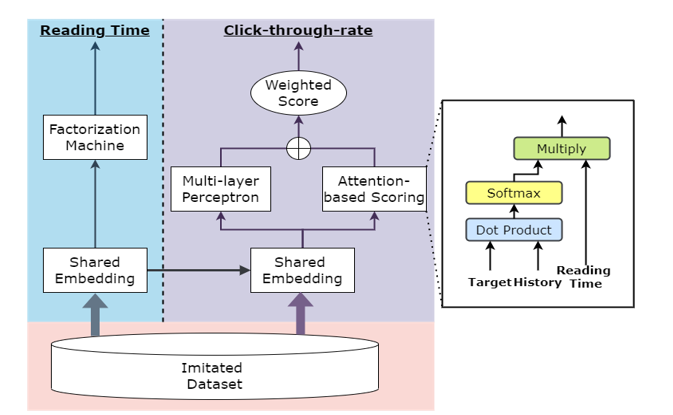

# MULABS: Multi-Task Learning with Attention-Based Scoring for Click-Through Rate Prediction on Sparse Data in Healthcare Real-World Scenarios
PyTorch code for MULABS: For a description of the model and experiments, see our paper: https://ieeexplore.ieee.org/document/9995650



## Setup
### Requirements
- Required (specific version used for experiments can be found in requirements.txt)
  - Python3
  - PyTorch
  - scikit-learn
  - tqdm 
  - numpy 
  - pandas
  - xgboost
  - nltk
  - gensim

## Examples
Supported model types include FM, CTR, DeepFM, RF, LR \
(1) Train FM:
```
python3 main.py --arch=FM  --log=fm  --reg=0.08  --lr=0.01
```

(2) Train CTR:
```
python3 main.py --arch=CTR
```

(3) Train RF
```
python3 main.py --arch=RF  --log=rf
```
## Reproduction of Experimental Results
- Execute *bin/experiments.sh*

## Additional Notes
- The optimal number of LDA topics is 10, you can execute **multiABS/nlp_utils.py** to check
- The generated LDA model are saved in **saved_models**, you can remove and regenerate
- The initial film data are saved in **ml-1m**
- The generated compact data sets are saved in **data**, you can remove this folder and re-generate


